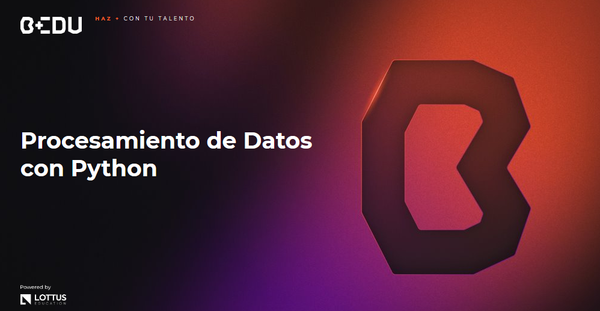

    

## 🎯 Objetivo del Curso

🐍 Aplicar el uso del lenguaje de programación Python para la manipulación efectiva, análisis y visualización de datos.

## 📚 Contenido del Curso

1. 🌟 [Sesión 01: Introducción a Python.](Sesion-01/Readme.md)
2. 🔁 [Sesión 02: Control del flujo, ciclos y condiciones.](Sesion-02/Readme.md)
3. 🛠️ [Sesión 03: Estructuras de datos y optimización.](Sesion-03/Readme.md)
4. 🔄 [Sesión 04: Programación funcional.](Sesion-04/Readme.md)
5. 🌐 [Sesión 05: Apis y bases de datos.](Sesion-05/Readme.md)
6. 📊 [Sesión 06: Pandas y análisis exploratorio de datos.](Sesion-06/Readme.md)
7. 🧹 [Sesión 07: Funciones vectorizadas, de agregación y limpieza de datos.](Sesion-07/Readme.md)
8. 🔍 [Sesión 08: Transformación, filtración y ordenamiento de datos.](Sesion-08/Readme.md)
9. 📁 [Datasets](Datasets/Readme.md)

➡️ [`Siguiente`](Sesion-01/Readme.md)

### 📝 NOTA: ¿Qué son las funciones de verificación?

> 🧐 Hay Retos que tienen funciones de verificación para hacer tests del código escrito por los alumnos. Cuando un Reto mencione una función de verificación, puedes encontrarla en la misma carpeta donde está el Reto, en un archivo llamado `helpers.py`.