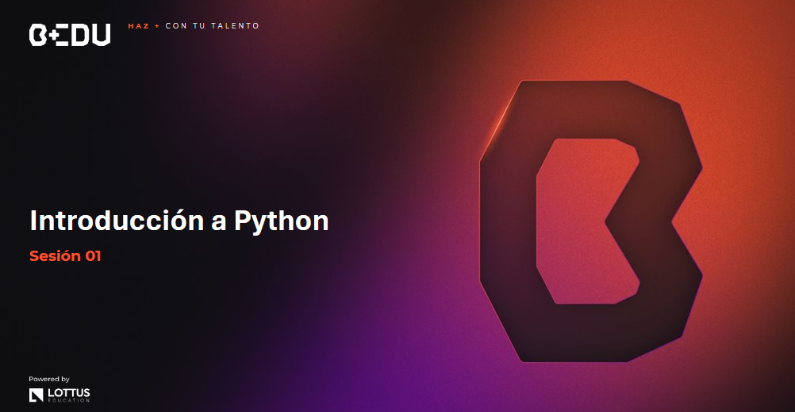

[`Procesamiento de datos con Python`](../README.md) > `Sesión 01`

    

## 🎯 Objetivo de la Sesión.

Identificar y comprender los conceptos básicos de Python, incluyendo variables, tipos de datos y operadores, para aplicarlos en la creación de programas sencillos.

### 📂 Organización de la sesión

- [Ejemplo 01: Variables.](Ejemplo-01/Readme.md)
- [Ejemplo 02: Tipos de Datos.](Ejemplo-02/Readme.md)
- [Reto 01: Variables y tipos de datos](Reto-01/Readme.md)

- [Ejemplo 03: Operadores relacionales.](Ejemplo-03/Readme.md)
- [Reto 02: Operadores](Reto-02/Readme.md)

[`Anterior`](../README.md) | [`Siguiente`](../Sesion-02/README.md)