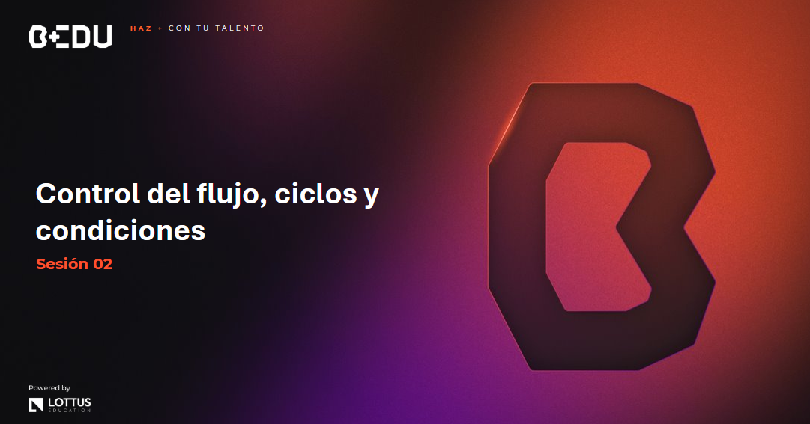

🏠 [**Inicio**](../Readme.md) ➡️ / 📖 `Sesión 02`

    

## 🎯 Objetivo

⚒️ Comprender y aplicar las estructuras de control de flujo en Python, como las sentencias if, match, while y for, para desarrollar programas con lógica condicional y ciclos.

---

📘 Material del prework:
Antes de comenzar con los ejercicios de esta sesión, recordemos que en el material de prework hemos cubierto los fundamentos teóricos que aplicaremos hoy. A lo largo de esta sesión, pondremos en práctica estos conceptos mediante una serie de ejercicios y retos diseñados para reforzar y validar nuestro entendimiento. 🔥¡Vamos a comenzar!🔥

## 📂 Temas de la sesión

### 📖 Sentencia If

Las sentencias condicionales en Python se usan para tomar decisiones en el flujo del programa basado en condiciones específicas.

- **if**: Ejecuta un bloque de código si una condición es verdadera.
- **if-else**: Ejecuta un bloque de código si una condición es verdadera; de lo contrario, ejecuta otro bloque de código.
- **if-elif-else**: Maneja múltiples condiciones, ejecutando diferentes bloques de código según cuál condición sea verdadera.

#### 📜 **[Ejemplo 01: Sentencia If](Ejemplo-01/Readme.md)**

---

### 📖 Sentencia For

Los ciclos `for` en Python se utilizan para iterar sobre una secuencia (como una lista, tupla, diccionario, conjunto o cadena) y ejecutar un bloque de código para cada elemento en la secuencia.

- **for**: Itera sobre una secuencia, ejecutando un bloque de código para cada elemento en la secuencia.
- **for-else**: Ejecuta un bloque de código para cada elemento en una secuencia, y luego ejecuta un bloque de código opcional después de que se completa el ciclo, a menos que se haya interrumpido con una sentencia `break`.

#### 📜 **[Ejemplo 02: Sentencia For](Ejemplo-02/Readme.md)**
#### 🔥 **[Reto 01: Búsqueda de articulo](Reto-01/Readme.md)**
---

### 📖 Sentencia Match

Las sentencias `match` en Python, introducidas en la versión 3.10, se utilizan para realizar coincidencias estructurales, similar a las sentencias `switch` en otros lenguajes. Permiten comparar un valor con varios patrones y ejecutar el bloque de código correspondiente al primer patrón coincidente.

- **match-case**: Esta sentencia recibe una expresión y compara su valor con patrones sucesivos dados en uno o más bloques case.

Estas sentencias son útiles para simplificar el código que necesita manejar múltiples condiciones basadas en la estructura de los datos.

#### 📜 **[Ejemplo 03: Sentencia match](Ejemplo-03/Readme.md)**

---

### 📖 Sentencia While

Los ciclos `while` en Python se utilizan para ejecutar un bloque de código repetidamente mientras una condición específica sea verdadera.

- **while**: Ejecuta un bloque de código repetidamente mientras una condición sea verdadera.
- **while-else**: Ejecuta un bloque de código repetidamente mientras una condición sea verdadera, y luego ejecuta un bloque de código opcional después de que el ciclo termine, a menos que se haya interrumpido con una sentencia `break`.

#### 📜 **[Ejemplo 04: Sentencia While](Ejemplo-04/Readme.md)**

#### 🔥 **[Reto 02: Pedido a domicilio](Reto-02/Readme.md)**
---

⬅️ [**Anterior**](../Readme.md) | [**Siguiente**](../Sesion-03/Readme.md) ➡️
