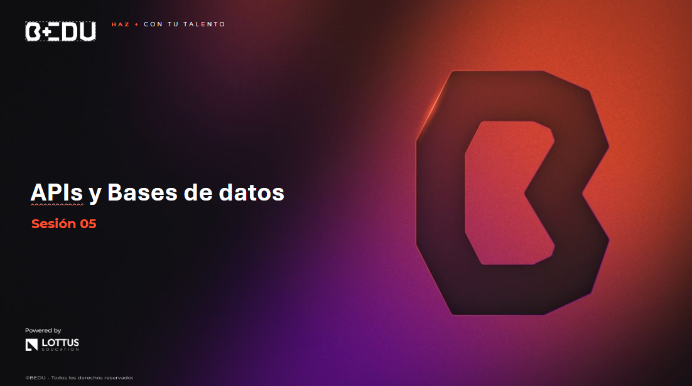

🏠 [**Inicio**](../Readme.md) ➡️ / 📖 `Sesión 05`

    

## 🎯 Objetivo

⚒️ Comprender y aplicar los conceptos de interacción con APIs, bases de datos MySQL y MongoDB, y participar en un círculo de estudio para reforzar el aprendizaje.

---

📘 Material del prework:
Antes de comenzar con los ejercicios de esta sesión, recordemos que en el material de prework hemos cubierto los fundamentos teóricos que aplicaremos hoy. A lo largo de esta sesión, pondremos en práctica estos conceptos mediante una serie de ejercicios y retos diseñados para reforzar y validar nuestro entendimiento. 
🔥¡Vamos a comenzar!🔥

---

## 📂 Temas de la sesión

### 📖 Interacción con APIs y sus métodos

Las APIs (Application Programming Interfaces) permiten a las aplicaciones comunicarse entre sí. En Python, interactuar con APIs es una habilidad esencial para obtener datos de servicios web y realizar operaciones de procesamiento de información en tiempo real.

Aprenderemos a usar bibliotecas como `requests` para enviar peticiones HTTP y procesar las respuestas. Además, veremos ejemplos prácticos de cómo conectarse a APIs y manejar los datos obtenidos.

#### 📜 **[Ejemplo 01: Interacción con APIs](Ejemplo-01/Readme.md)**
#### 🔥 **[Reto 01: Buscador de peliculas favoritas](Reto-01/Readme.md)**

---

### 📖 Bases de datos MySQL y MongoDB

Las bases de datos son fundamentales para gestionar y analizar grandes volúmenes de información en tiempos extremadamente cortos. Exploraremos cómo conectarnos y realizar operaciones básicas en bases de datos relacionales como MySQL y NoSQL como MongoDB.

Para MySQL, usaremos la biblioteca `mysql-connector-python`, y para MongoDB, la biblioteca `PyMongo`. Aprenderemos a realizar consultas, así como a manejar cursores para iterar sobre resultados.

#### 📜 **[Ejemplo 02: Base de datos MySQL y MongoDB](Ejemplo-02/Readme.md)**
#### 🔥 **[Reto 02: Sistema ](Reto-02/Readme.md)**

---

### ⭕ Círculo de estudio

En el círculo de estudio se destinara una hora para reforzar los temas aprendidos durante las sesiones previas. Asi mismo compartiran los enlaces y/o documentos relacionados al avance de sus proyectos.

#### 📜 **[Circulo: Formato de preguntas y respuestas](Ejemplo-03/Readme.md)**

---

⬅️ [**Anterior**](../Readme.md) | [**Siguiente**](../Sesion-06/Readme.md) ➡️